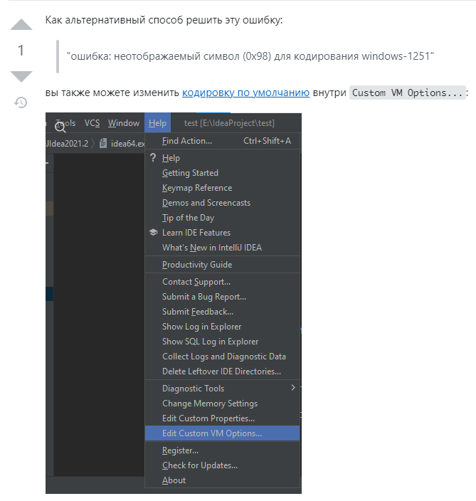
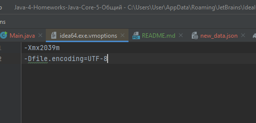

# Ошибка с корректным отображением символов "И" и подобной латиницы




внутри `Custom VM Options...:` добавляем следующую строчку:

``` java
-Dfile.encoding=UTF-8
```
**Помощь** | 
**Отредактируйте** пользовательские параметры виртуальной машины, 
затем ***перезапустите*** `IntelliJ IDEA.`

